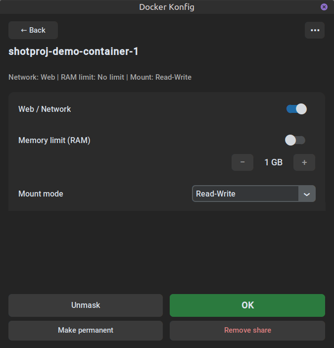

# Docker-Shell

[](https://github.com/nixxterger/Docker_shell/actions/workflows/ci.yml)

**Control what a Docker container and local AI agentsmay do with your folders — straight from the file manager.**

Docker-Shell adds a small control panel to your file manager. Right-click a folder and change a running compose container's access without manually editing YAML.
Useful for local coding agents, automatic tools and experimental containers that should not have unrestricted access to your files.

<p align="center"></p>

Right-click a folder → *Docker Konfig* → pick a running compose container → configure:

| Feature | What it does |
|---|---|
| **Web / Network** | Toggle full network isolation (`network_mode: none`) per project |
| **Memory limit** | Cap the container's RAM in 1-GB steps |
| **Mount mode** | Read-Write · Read-Only · Hidden (masked) · Main folder only |
| **Add folders** | Folders not mounted yet can be added on the fly |
| **Unmask** | One click resets all masks back to read-only |
| **Make permanent / Remove share** | Persist a folder's config into the main compose file, or remove its mount entirely |
| **Settings** (⋯ menu) | Window position, UI size, language, add-folder naming, defaults, network scope, project reset |

### The masking trick

*Hidden (masked)* bind-mounts an empty **sacrificial folder** over the real
one inside the container. Your data stays physically on disk but becomes
invisible to the container — an effective guard against `rm -rf`, runaway
scripts and AI-agent hallucinations. *Main folder only* keeps the top level
readable while masking every first-level subdirectory individually.

### How changes are applied

```
file manager trigger
  → docker inspect            (scan + live status)
  → PyYAML                    (<compose>.override.yml — regenerated per apply)
  → main compose edit         (network_mode only, with automatic backup)
  → docker compose up -d
```

The main compose file is only ever touched for the network toggle, and the
original is backed up to `.docker_shell_compose_bak` before the first edit.
Everything else lives in the override file, which can be deleted at any time
to return to the original configuration. Safety defaults (UID/GID mapping,
log rotation) are always included.

> **Note:** Docker-Shell rewrites compose YAML with PyYAML — comments and
> custom formatting in the *main* compose file are not preserved when the
> network toggle is used (backup exists). The override file is fully owned
> by the tool.

## Requirements

- Linux, Python ≥ 3.8 with `tkinter` (`sudo apt install python3-tk`)
- Docker with Compose v2, user in the `docker` group
- Supported compose file names: `compose.yaml`, `compose.yml`,
  `docker-compose.yml`, `docker-compose.yaml`

## Install

```bash
git clone https://github.com/nixxterger/Docker_shell.git
cd Docker_shell
bash setup.sh
```

Installs to `~/.local/share/docker-shell` (venv included), adds a
`docker-shell <folder>` CLI launcher and hooks into the file managers it
finds. GUI language follows the system locale (English default, German
built in, more via language files). Remove everything with
`bash uninstall.sh`.

## File manager integrations

| File manager | Integration | Installed by setup.sh |
|---|---|---|
| Nemo (Mint/Cinnamon) | Right-click a folder → "Docker Konfig" | ✔ |
| Nautilus (GNOME) | Right-click → Scripts → "Docker Konfig" | ✔ |
| Dolphin (KDE) | Folder context menu → "Docker Config" | ✔ |
| Thunar (XFCE) | Custom action, see [integrations/thunar](integrations/thunar/README.md) | manual |
| Any / none | `docker-shell <folder>` from a terminal | ✔ |

## Settings

The ⋯ menu opens a settings dialog (stored in
`~/.config/docker-shell/config.yml` — the tool works fine without ever
opening it):

| Key | Values (default first) | Meaning |
|---|---|---|
| `window_position` | `pointer` / `center` | Where the window opens |
| `ui_scale` | `auto` / `small` / `medium` / `large` | Widget scaling |
| `language` | `auto` / `en` / `de` / `<code>` | UI language (`auto` = system locale) |
| `add_new_mode` | `host_path` / `preset` / `ask` | Container path when adding a new folder |
| `add_new_preset` | `/mnt/{name}` | Template for `preset` mode (`{name}` = folder name) |
| `new_mount_default` | `ro` / `rw` | Preselected mode for newly added folders |
| `network_scope` | `all` / `service` | Network toggle hits the whole project or only the selected service |
| `temp_leer` | path | Custom sacrificial folder |

The menu also offers **Reset project**: deletes the override file and
restores the main compose file from its backup.

**Custom languages:** drop a `lang/<code>.yml` file (English string →
translation, see `lang/TEMPLATE.yml.example`) next to the app or into
`~/.local/share/docker-shell/lang/`, then select the code in the settings.

## Tests

```bash
python3 tests/test_e2e.py   # needs Docker; uses a throwaway alpine container
```
⚠️ Hobby project maintained by one person. Use at your own risk (backups included by design).

## License

MIT
